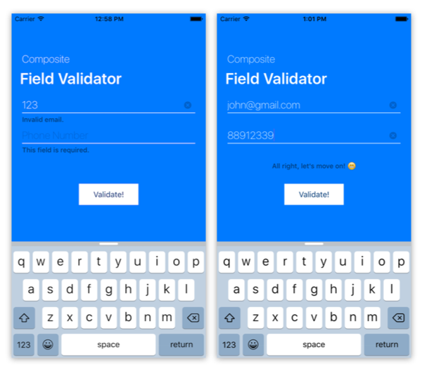

# Design Patterns - Composite

## Form Validator

This project is an example of how to use the Composite Design Pattern in a real application.

### EmailFieldValidator
Composed by:
* DPRequiredFieldValidator
* DPEmailFieldValidator

### PhoneFieldValidator
Composed by: 
* DPNumberFieldValidator
* DPRequiredFieldValidator
* DPMinLengthFieldValidator
* DPMaxLengthFieldValidator

### Advantage

Once the validators are created, their logic ca be easly reused on any other form.

